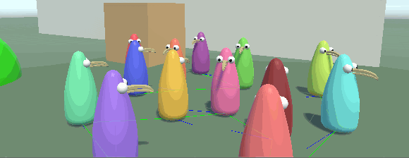
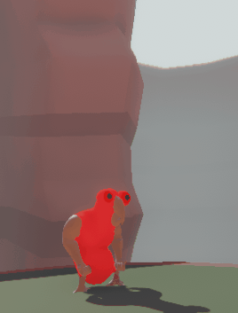

# :bird: Bird Tech

Hi! I'm just uploading a small number of scripts related to my project [Bird by Example](https://noahburkholder.itch.io/bird-by-example). The project is on a private repository, but I've exposed some C# scripts that employers and other developers may be curious about.

Specifically:
1. ([NeuralNet.cs](Scripts/NeuralNet.cs)) The Recurrent Neural Network system I'm using. It's very customized to the weirdness of Bird by Example, but I've commented it extensively to help it make sense.
2. ([BirdIdentity.cs](Scripts/BirdIdentity.cs)) A script used for introducing fluctuations in contextual perception. In other words: If all birds were to share the same neurology, this script makes bird perceptrons interpret the environment differently. This system will be toggleable in the end product, so that experimentation with social cohesion behaviour is afforded to curious players.
3. ([BirdBody.cs](Scripts/BirdBody.cs)) The body of a bird. Manages health, RPG stats, and visuals.
4. ([Pool.cs](Scripts/Pool.cs)) Singleton designed to dynamically organize and recycle gameplay objects to avoid waste. Keeps track of Objects, Particles, and Debris, which are all recycled slightly differently. Script will change as new systems are implemented.
5. ([Thumbnailer.cs](Scripts/Thumbnailer.cs)) This class takes passport photos for each bird using a secondary invisible camera. Pictures are then exported to disk with an ID that ties them to a bird. These thumbnails will then be used in a type of Pokedex system, but for birds.
6. ([Interactable.cs](Scripts/Interactable.cs)) A GameObject which birds react neurologically to (based on what it 'evokes'). These evokes afford birds to transfer skills and behaviours based on shared attributes on disparate objects. Also holds information about its physical properties.
7. ([Flora.cs](Scripts/Flora.cs)) Fruit-bearing flora script. An example of the Pool.cs being used to recycle fruit.
8. ([Qualities.cs](Scripts/Qualities.cs)) Helper script which outlines the different qualities which Interactable.cs (and child classes) can evoke.

I'll update this repo from time to time if there's a script which people are asking about. I talk a fair bit about the systems on my [Discord](https://discord.gg/UWeXjUf) so sometimes it makes sense to link to a public codebase.

## The Journey

I began Bird by Example in April 2019 (known back then as 'BirdTest'), and over the course of a week — listening to [Steve Reich](https://youtu.be/02hnXKDR4tg) for 13 hours a day — got a somewhat functional C# Neural Net with backpropagation.

### April 4th, 2019

This was the first .gif of the project I ever made. It was right after I got my first feed-forward network to work. The movement code was super badly integrated at this point, and I would later find that my trigonometry was slightly sub-optimal for bird steering.

### April 8th, 2019

At this point I had worked out some issues with steering, and future-proofed a few perceptrons. I also began working on teacher-student learning wherein birds would choose a bird in their vicinity to focus on and try to optimize their own neurology to this teacher bird. This is why their eyes are now moving to look at the other birds around them.

Don't mind the arms, I was figuring some stuff out.

Certain birds might get isolated from the flock, and would retain individualism in their neurology until they stumbled back home and got caught by peer-pressure.

### April 10th, 2019

At this third stage in development, all the systems came together in their most basic form, and the birds were able to reach neurological consensus! I could randomize their neurologies, and over the course of a couple minutes the entire population would begin to follow a particular doctrine. Practically though, it just meant birds would run clockwise or counter-clockwise.

I also did a bit of work in Blender to finish the bird model and gave some basic animations.

### Under Construction

More sections soon!

